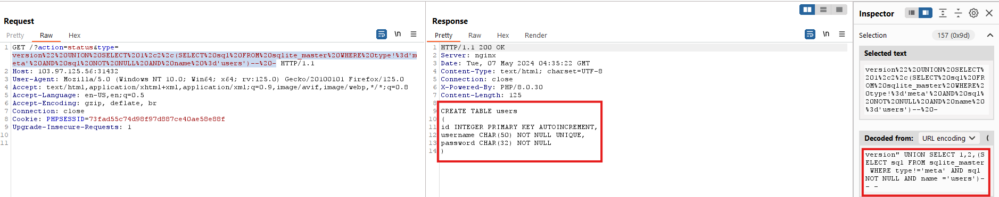
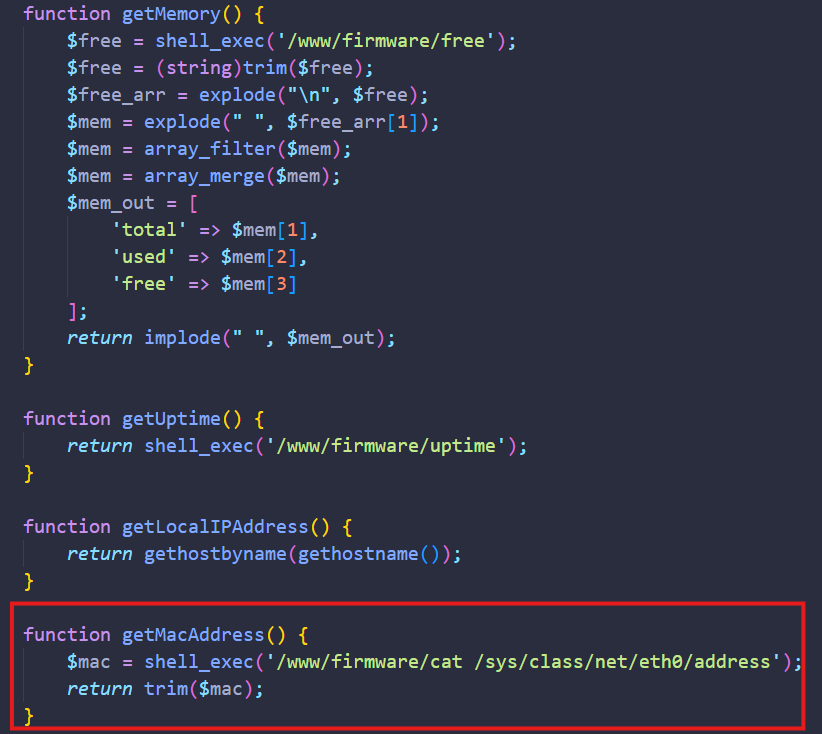

Challenge này có những chức năng chính như sau:

- **Guest**: Login, View Firmware Version.
- **Admin**: View Message Log, Upload and Upgrade Firmware, Backup Firmware.

Truy cập challenge tại [đây](https://battle.cookiearena.org/arenas/final-exam-0x03).

## Information Gathering

Trước khi bắt đầu bắt đầu làm mình sẽ dùng extension [Wappalyzer](https://www.wappalyzer.com/) để detect những công nghệ mà trang web sử dụng.

## K03FE FLAG 1

Flag 1 yêu cầu khai thác lỗ hổng và truy cập vào cơ sở dữ liệu nên mình nghĩ ngay đến lỗ hổng SQLi và có thêm một thông tin nữa là flag nằm ở trong bảng chứa giá trị cấu hình của hệ thống.

Đầu tiên, mình sẽ thử test ở chức năng đăng nhập nhưng kết quả là không tìm thấy lỗ hổng SQLi ở đây. Mở source của trang thì mình tìm thấy thêm 1 endpoint mới.

Mình thử thêm kí tự `"` vào sau version thì nhận được thông báo lỗi và biết được DB mà trang web dùng là SQLite3.

Mình thử payload khác: `version" OR 1=1-- -` thì có được flag đầu tiên.

**FLAG 1:** `CHH{BA5ic_5qL_iNj3CtiON}`.

## K03FE FLAG 2

Ở flag số 2 này yêu cầu tìm mật khẩu của tài khoản `cookie` ở dạng hash và tiến hành crack để có được mật khẩu. Vì ở flag 1 mình đã xác định lỗ hổng SQLi ở biến `type` nên mình sẽ tiếp tục khai thác để truy cập vào DB lấy mật khẩu của tài khoản `cookie`. Mình sẽ dùng kiểu `UNION-based` để khai thác.

### Exploit

**Bước 1:** Xác định số cột của bảng hiện tại

- Payload: `version" ORDER BY 3-- -`.
- Xác định được bảng hiện tại có 3 cột.

**Bước 2:** Xác định cột hiển thị dữ liệu ra ngoài

- Payload: `version" UNION SELECT 1,2,3-- -`.
- Xác định được cột số 3 hiển thị dữ liệu ra bên ngoài.

**Bước 3:** Xác định các bảng trong DB

- Payload: `version" UNION SELECT 1,2,(SELECT group_concat(tbl_name) FROM sqlite_master WHERE type='table' and tbl_name NOT like 'sqlite_%')-- -`.
- Xác định được 2 bảng trong DB hiện tại là: `configurations` và `users`.
- Mục tiêu là lấy được mật khẩu của tài khoản `cookie` => tập trung vào bảng `users`.

**Bước 4:** Xác định tên cột của bảng `users`

- Payload: `version" UNION SELECT 1,2,(SELECT sql FROM sqlite_master WHERE type!='meta' AND sql NOT NULL AND name ='users')-- -`.
- Xác định được bảng `users` có 3 cột là: `id`, `username`, `password`.

**Bước 5:** Trích xuất dữ liệu từ bảng `users`

- Payload: `version" UNION SELECT 1,2,(select group_concat(username || '-' || password) FROM users)-- -`.
- Lấy được mật khẩu dạng hash của tài khoản `cookie` là: `1ff61e91349d3f6623a81ccd3d881fa1`.

Mật khẩu này có 32 kí tự nên mình sẽ thử decrypt MD5. Và kết quả là mình nhận được chuỗi: `harrypotter` là mật khẩu crack được. Giờ chỉ cần login vào và lấy flag.

**FLAG 2:** `CHH{cr4ck3D_h45h_SQLi}`.

## K03FE FLAG 3

Flag số 3 này yêu cầu đọc file `/etc/passwd` để lấy flag. Đọc file thì mình nghĩ đến 3 lỗ hổng đó là: Path Traversal, File Upload và SSRF. Sau khi xem qua hết chức năng của trang thì mình loại được SSRF vì không có chức năng xử lý URL. Còn hai chức năng khác là `View Message Log` có tham số `file` có khả năng bị Path Traversal và chức năng `Update Firmware` cho phép chúng ta upload 1 file zip lên hệ thống có khả năng upload 1 webshell thực hiện RCE.

Trước tiên mình sẽ test chức năng `View Message Log` trước. Mình thử truyền vào `file=../message` nhưng server vẫn trả về kết quả log nên mình đoán là nó đã filter `../`. Mình sửa lại payload thành `file=....//message` thì:

Server báo `File not found` nên vẫn có thể tham số `file` bị Path Traversal. Mình tiếp tục thử payload: `file=....//....//etc/passwd` thì đây là kết quả:

Đã đọc được file `/etc/passwd` giờ chỉ cần copy flag và submit thôi !

**FLAG 3:** `CHH{f1L3_path_tr4verSAl}`.

## K03 Start Me Now

Flag cuối cùng yêu cầu chúng ta đọc file `/flagXXXX.txt`. Đọc dạng file flag như thế kia làm mình liên tưởng đến lỗ hổng File Upload và OS Command Injection. Còn hai chức năng mình chưa test đó là `Backup Firmware` và `Upload and Upgrade Firmware`. Giờ mình sẽ thử chức năng `Backup Firmware` trước.

Đây là những file sau khi mình giải nén ra. Mình chú ý đến các file như: `cat`, `free`, `ping`, `unzip`,... thử mở file `cat` ra xem thì thấy file là 1 đoạn script shell được thực thi bằng shell `/bin/sh` và hiển thị nội dung của một tệp thông qua đối số đầu tiên được truyền vào (`$1` đại diện cho đối số đầu tiên được truyền vào khi gọi script). Nên mình sẽ thử thay `$1` thành `/flag*.txt` xem sao.

Trước khi up file zip mình chỉnh sửa lên thì mình sẽ thử up 1 file không có những file shell script lên xem thử có gì xảy ra không.

Warning ở file `/www/views/home.php` mà mình có thể đọc file thông qua lỗ hổng Path Traversal ở flag số 3 nên mình sẽ lấy source của file `home.php` về xem thử.

Thì ở hàm `getMacAddress()` sẽ gọi đến shell lấy file `cat` vừa up lên và in ra nội dung của file `/sys/class/net/eth0/address` như mình đã trình bày về cách hoạt động ở trên. Giờ chỉ cần up file `cat` đã chỉnh sửa lên và lấy flag thôi!

**FLAG 4:** `CHH{H4PPy_c0MmaND_INjeCtIoN_58bd50f97a9f8882343a963009eeb761}`.

## TỔNG KẾT

1.  FLAG 1: Lỗ hổng **SQL Injection** ở tham số `type`.
2.  FLAG 2: Lỗ hổng **SQL Injection** ở tham số `type` (Khai thác UNION-based).
3.  FLAG 3: Lỗ hổng **Path Traversal** ở tham số `file`.
4.  FLAG 4: Lỗ hổng **OS Command Injection** ở những file shell script (Chức năng Backup Firmware).

Cảm ơn các bạn vì đã đọc đến đây! Nếu có sai sót gì trong quá trình giải challenge mong các bạn góp ý với mình ở phần !
