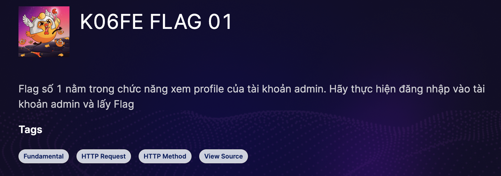

Challenge này có những chức năng chính như sau:

- **Guest**: Login, Register.
- **User**: View Profile, Change Password, Logout.
- **Admin**: View Profile, Change Password, Admin Dashboard(Modify Info Picture, Restore, User), Logout.

Truy cập challenge tại [đây](https://battle.cookiearena.org/arenas/final-exam-0x06).

## Information Gathering

Trước khi bắt đầu làm mình sẽ dùng extension [Wappalyzer](https://www.wappalyzer.com/) để detect những công nghệ mà trang web sử dụng.

Vậy mình đã biết được ngôn ngữ lập trình của website sử dụng là PHP và server là Nginx. Tiếp đến mình sẽ sử dụng [dirsearch](https://github.com/maurosoria/dirsearch) để tìm kiếm những thư mục và file trên website.

## K06FE FLAG 01

Flag đầu tiên nằm ở trong chức năng xem profile của tài khoản admin => Mình phải **login được vào tài khoản admin**. Trước tiên, mình sẽ tạo 1 tài khoản để đăng nhập vào hệ thống xem có gì hay ho không.

Và mình đã có được email của admin khi click vào xem một bức tranh. Giờ chỉ cần lấy được mật khẩu của admin là có thể vào được tài khoản của admin.

Chức năng mình chú ý là chức năng đổi mật khẩu. Chức năng này:

- Không yêu cầu nhập lại mật khẩu cũ.
- Truyền vào id của người dùng.

Nên mình sẽ thử bắt request và sửa từ id=2 thành id=1 (Vì id hiện tại của mình là 2 nên mình đoán admin sẽ là id=1) và tiến hành đổi mật khẩu.

Giờ chỉ cần login vào tài khoản admin và lấy flag thôi!

**FLAG 1:** `CHH{n0_On3_c4N_Ch4ng3_y0uR_p4s5}`

## K06FE FLAG 02

Flag thứ 2 nằm trong cơ sở dữ liệu. Mà nhắc đến CSDL thì sẽ nghĩ ngay đến SQLi. Ở đây tài khoản admin có một trang là Admin Dashboard. Vào trang này, thì mình thấy có một thanh search => Có thể thanh search này bị SQLi.

Mình thử tìm "1" thì kết quả hiện thị 3 bức tranh. Thử lại "1'" thì website đã văng ra lỗi và hiển thị câu truy vấn sử dụng.

Trước tiên, mình cần xác định số cột của bảng. Mình dùng ORDER BY để xác định số cột.
=> **Payload xác định số cột:** `999999' ORDER BY 3-- -`
Sau đó, mình sẽ tiếp tục dùng UNION để xác định những cột hiển thị kết quả ra màn hình.
=> **Payload:** `999999' UNION SELECT 'mot','hai','ba'-- -`

Hai cột mà dữ liệu hiển thị ra màn hình là cột số 1 và 3. Giờ mình sẽ xác định DB mà web sử dụng.
=> **Payload xác định DB:** `999999' UNION SELECT 1,2, (SELECT version())-- -`

Vậy DB mà web sử là: **MariaDB-10.3.39**. Giờ tiếp tục xác định những bảng có trong DB.
=> **Payload xác định bảng:** `999999' UNION SELECT 1,2, (SELECT group_concat(table_name) FROM information_schema.tables WHERE table_schema=database())-- -`

Ta thấy có bảng `flag`. Tiếp tục tiến hành xác định số cột của bảng `flag`.
=> **Payload xác định số cột bảng flag:** `999999' UNION SELECT 1,2, (SELECT group_concat(column_name) FROM information_schema.columns WHERE table_name='flag')-- -`

Đã có tên cột và tên bảng giờ chỉ cần truy vấn lấy ra flag thôi!

**FLAG 2:** `CHH{S4n1tiZ3_1NpUt_pL3A5e}`

## K06FE FLAG 03

Flag số 3 yêu cầu chúng ta đọc được nội dung của file `password.php`. Dạo một vòng thì mình tìm thấy admin có thể sửa hình ảnh của bức tranh thông qua URL làm mình liên tưởng đến lỗ hổng SSRF. Lỗ hổng này có thể đọc nội dung của một file trong hệ thống bằng`file://path_file`.

Mình sẽ thử với payload: `file:///etc/passwd`. Và đây là kết quả:

Mình đã đọc được toàn bộ nội dung của file `/etc/passwd` trong hệ thống. Mình có thêm một thông tin nữa đó là Root path của web là ở `/www`.

Giờ thì chỉ cần vào đọc file `password.php` ở đường dẫn `/www/password.php`.

**FLAG 3:** `CHH{SSRF_i5_k1nD4_iNt3rE5t1n6}`

## K06FE Start Me Now

Flag cuối cùng này mình sẽ phải tạo 1 webshell up lên hệ thống và đọc flag. Để ý ở FLAG 3 khi mình đọc được nội dung file `password.php` có thêm 1 thông tin là mật khẩu để truy cập vào chức năng Restore của hệ thống. Mật khẩu là: `samuelSAMUEL5@mu3L`.

Chức năng này cho phép khôi phục lại những hình ảnh bằng cách lấy thông tin từ 1 file json rồi update lại.

Ở đây tham số truyền vào là 1 file. Mà muốn upload webshell thì có hai khả năng là File Upload hoặc File Inclusion. Ở FLAG 3 phần trước, mình có thể đọc được nội dung file trong hệ thống. Vậy mình sẽ lấy source của file `detail-restore.php` về để đọc thử.

Giá trị `file` truyền vào từ URL không được validate. Thêm sự xuất hiện của hàm `include`. Mình có thể chắc chắn rằng tham số `file` có chứa lỗ hổng File Inclusion.
Giờ mình chỉ cần upload 1 file shell lên hệ thống. Mà ở FLAG 3, mình có chức năng upload ảnh thông qua URL nên mình chỉ cần truyền vào 1 URL có chứa source php lên. Đây là [URL](https://gist.githubusercontent.com/joswr1ght/22f40787de19d80d110b37fb79ac3985/raw/50008b4501ccb7f804a61bc2e1a3d1df1cb403c4/easy-simple-php-webshell.php) mà mình sử dụng.

Để ý đây chính là chỗ lưu file shell mình vừa up lên. Giờ hãy quay lại chức năng Restore và truyền vào đường dẫn đến file webshell và thêm tham số `cmd` là câu lệnh muốn thực hiện.

**FLAG 4:** `CHH{C4r3FuL_w1Th_tH3_include_fUnCt10N_8eca4009143b213ad1c6c23ada2afd49}`.

## TỔNG KẾT

1. FLAG 1: Lỗ hổng **IDOR** ở tham số id.
2. FLAG 2: Lỗ hổng **SQL Injection** ở thanh Search.
3. FLAG 3: Lỗ hổng **SSRF** ở chức năng upload hình ảnh thông qua URL.
4. FLAG 4: Lỗ hổng **File Inclusion** (Tham số đầu vào file không được validate) và **File Upload** (Không kiểm tra nội dung truyền vào có phải là hình ảnh không).

Cảm ơn các bạn vì đã đọc đến đây! Nếu có sai sót gì trong quá trình giải challenge mong các bạn góp ý với mình ở phần comment!
